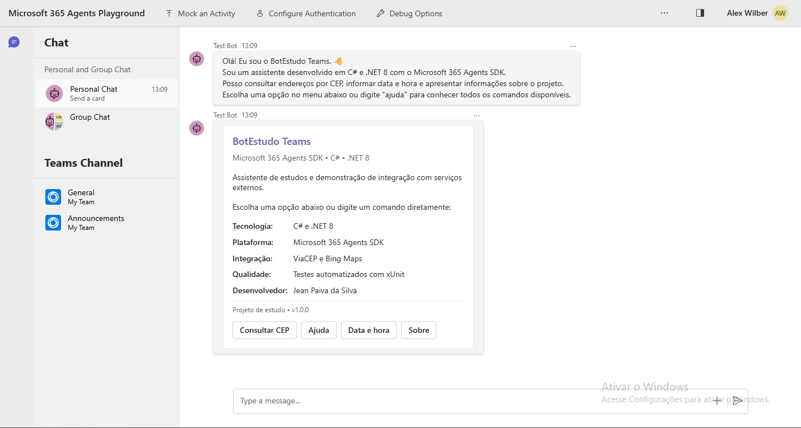

# BotEstudo Teams

Chatbot desenvolvido em **C# e .NET 8** com o **Microsoft 365 Agents SDK**, criado como projeto de estudo sobre desenvolvimento de agentes conversacionais para o Microsoft Teams.

O projeto possui menu interativo com Adaptive Cards, processamento de comandos, consulta de endereços utilizando a API ViaCEP, integração com o Bing Maps, logging e testes automatizados com xUnit.

## Demonstração

### Menu principal



### Consulta de CEP

O usuário pode informar um CEP com ou sem formatação:

```text
cep 01001-000