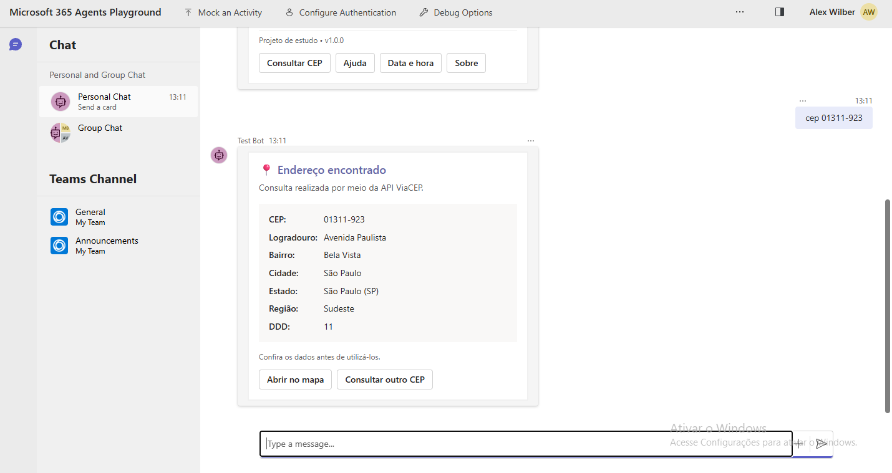
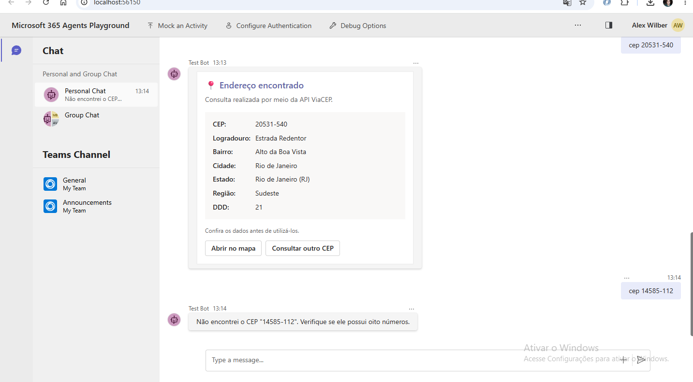
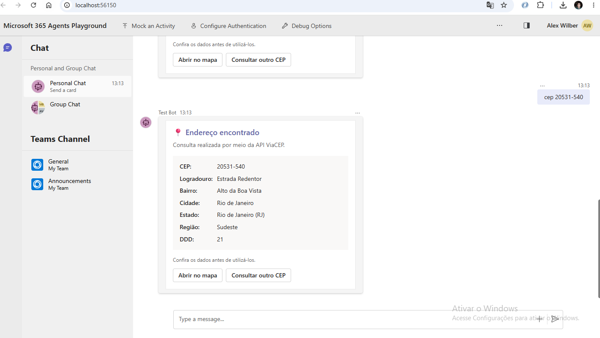
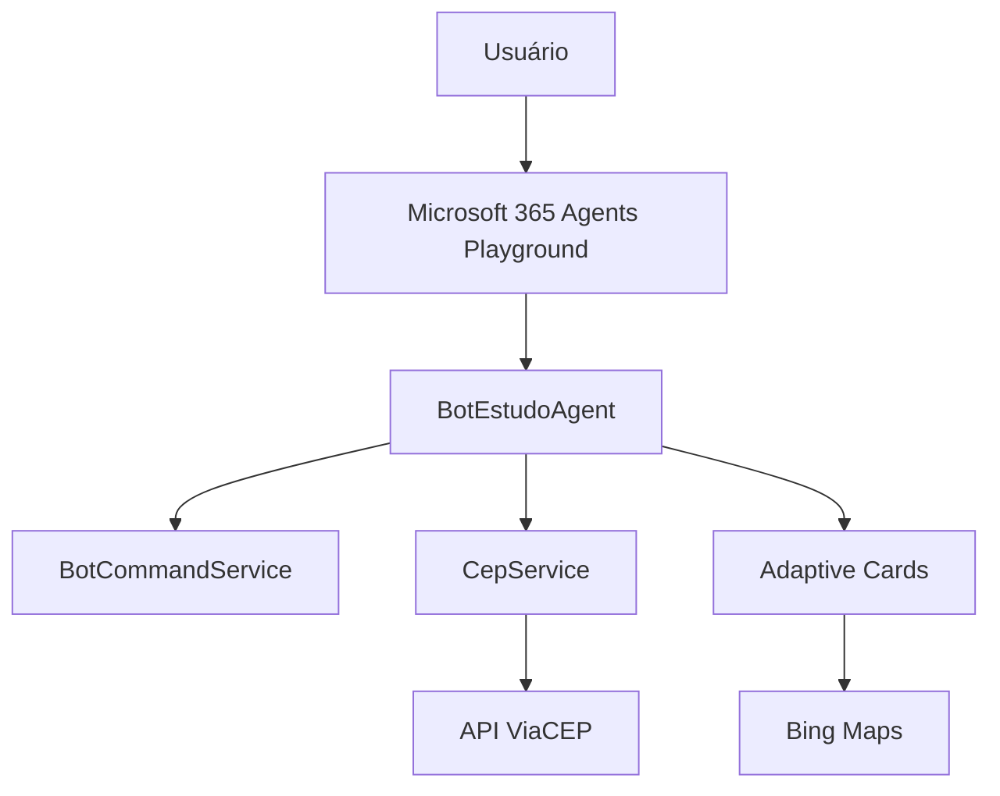

<p align="center">
  
</p>

<h1 align="center">BotEstudo Teams</h1>

<p align="center">
  Chatbot para Microsoft Teams desenvolvido com C#, .NET 8 e Microsoft 365 Agents SDK.
</p>

<p align="center">
  
  
  
  
  
</p>

## Sobre o projeto

O **BotEstudo Teams** é um projeto de estudo criado para demonstrar, de forma prática, como construir um agente conversacional em C# para o ecossistema Microsoft Teams.

Além de responder a comandos, o bot consulta endereços na API ViaCEP, apresenta resultados com Adaptive Cards e oferece acesso ao endereço no Bing Maps. A solução também aplica práticas importantes de desenvolvimento .NET, como injeção de dependência, Options Pattern, HttpClient tipado, logging e testes automatizados.

> O projeto foi desenvolvido e validado localmente no **Microsoft 365 Agents Playground**. A instalação em uma organização real do Teams exige registro e configuração em um tenant Microsoft 365 corporativo ou educacional.

## Demonstração

### Menu interativo

Ao iniciar a conversa, o usuário recebe uma apresentação do bot e uma Adaptive Card com os principais comandos.

<p align="center">
  
</p>

### Consulta de CEP

O comando aceita CEP com ou sem formatação:

```text
cep 01001-000
```

<p align="center">
  
</p>

Quando o CEP é encontrado, o endereço é apresentado em uma Adaptive Card, com opção para abrir a localização no Bing Maps ou iniciar uma nova consulta.

<p align="center">
  
</p>

Entradas inválidas e CEPs inexistentes também são tratados:

<p align="center">
  
</p>

## Principais funcionalidades

- mensagem de boas-vindas;
- menu interativo com Adaptive Card;
- processamento e normalização de comandos;
- consulta assíncrona de CEP pela API ViaCEP;
- exibição profissional do endereço em Adaptive Card;
- botão para abrir o endereço no Bing Maps;
- opção para realizar uma nova consulta;
- tratamento de CEP inválido ou inexistente;
- tratamento de indisponibilidade e timeout da API;
- configuração externa com Options Pattern;
- HttpClient tipado e injeção de dependência;
- logging com `ILogger`;
- testes automatizados com xUnit.

## Comandos disponíveis

| Comando | Ação |
|---|---|
| `oi`, `olá` ou `ola` | Inicia uma conversa |
| `menu` | Exibe novamente o menu interativo |
| `ajuda` ou `/ajuda` | Lista os comandos disponíveis |
| `data` ou `Data e Hora` | Informa a data e a hora atual |
| `sobre` | Apresenta informações sobre o projeto |
| `cep 01001-000` | Consulta um endereço pelo CEP |

## Arquitetura e fluxo



O fluxo de consulta funciona da seguinte maneira:

1. O usuário envia `cep` seguido do número.
2. O `BotEstudoAgent` identifica a intenção.
3. O `CepService` normaliza e valida o valor informado.
4. O HttpClient consulta a API ViaCEP de forma assíncrona.
5. A resposta é desserializada para `CepResponse`.
6. O endereço é transformado em uma Adaptive Card.
7. O usuário pode abrir o mapa ou iniciar uma nova consulta.

## Organização da solução

```text
BotEstudoTeams/
├── .github/
├── BotEstudoTeams/
│   ├── Agents/
│   │   ├── Cards/
│   │   │   ├── CepAdaptiveCard.cs
│   │   │   └── MenuAdaptiveCard.cs
│   │   └── BotEstudoAgent.cs
│   ├── Assets/
│   ├── Configurations/
│   │   └── ViaCepOptions.cs
│   ├── Models/
│   │   └── CepResponse.cs
│   ├── Services/
│   │   ├── BotCommandService.cs
│   │   ├── CepService.cs
│   │   ├── IBotCommandService.cs
│   │   └── ICepService.cs
│   ├── Program.cs
│   └── appsettings.json
├── BotEstudoTeams.Tests/
│   ├── BotCommandServiceTests.cs
│   ├── CepAdaptiveCardTests.cs
│   ├── CepServiceTests.cs
│   └── MenuAdaptiveCardTests.cs
└── BotEstudoTeams.sln
```

## Tecnologias

| Tecnologia | Utilização |
|---|---|
| C# e .NET 8 | Linguagem e plataforma principal |
| ASP.NET Core | Hospedagem e endpoint do agente |
| Microsoft 365 Agents SDK | Processamento das atividades conversacionais |
| Adaptive Cards | Interface visual e ações interativas |
| ViaCEP | Consulta de endereços |
| Bing Maps | Visualização do endereço |
| HttpClient | Comunicação HTTP assíncrona |
| xUnit | Testes automatizados |
| Microsoft 365 Agents Playground | Execução e validação local |

## Configuração

A integração com a API ViaCEP é configurada em `BotEstudoTeams/appsettings.json`:

```json
{
  "ViaCep": {
    "BaseUrl": "https://viacep.com.br/",
    "TimeoutSeconds": 10
  }
}
```

A seção é carregada por `ViaCepOptions`, validada na inicialização e usada na configuração do HttpClient.

## Como executar

### Pré-requisitos

- [.NET 8 SDK](https://dotnet.microsoft.com/download/dotnet/8.0);
- [Node.js e npm](https://nodejs.org/);
- Visual Studio 2022, Visual Studio Code ou outra IDE compatível.

### 1. Clonar o repositório

```bash
git clone https://github.com/jeanalgoritimo/BotEstudoTeams.git
cd BotEstudoTeams
```

### 2. Restaurar, compilar e testar

```bash
dotnet restore
dotnet build
dotnet test
```

### 3. Instalar o Microsoft 365 Agents Playground

```bash
npm install -g @microsoft/teams-app-test-tool
```

### 4. Executar o bot

No primeiro terminal:

```bash
dotnet run --project BotEstudoTeams/BotEstudoTeams.csproj
```

O Playground espera o endpoint:

```text
http://127.0.0.1:3978/api/messages
```

### 5. Abrir o Playground

Em outro terminal:

```bash
teamsapptester
```

O navegador será aberto automaticamente. A porta do Playground, como `http://localhost:56150`, pode variar a cada execução.

## Testes automatizados

A suíte de testes valida:

- saudações e variações de maiúsculas, acentos e espaços;
- comandos de ajuda, data, menu e informações do projeto;
- mensagens vazias, nulas e comandos desconhecidos;
- estrutura e ações das Adaptive Cards;
- normalização e validação do CEP;
- respostas válidas, inválidas e vazias da API;
- campo `erro` retornado pela ViaCEP;
- botões do Bing Maps e de nova consulta.

Execute os testes com:

```bash
dotnet test
```

## Tratamento de erros

O bot trata CEP inválido, endereço não encontrado, timeout, indisponibilidade da API, cancelamento da operação e falhas inesperadas.

Detalhes técnicos são registrados com `ILogger`, enquanto o usuário recebe mensagens simples, seguras e orientativas.

## Próximas evoluções

- [ ] configurar integração contínua com GitHub Actions;
- [ ] criar o manifesto do aplicativo Teams;
- [ ] registrar o bot em um tenant Microsoft 365;
- [ ] publicar e validar o aplicativo no Microsoft Teams;
- [ ] adicionar novos serviços e comandos;
- [ ] avaliar integração com IA generativa.

## Aprendizados demonstrados

Este projeto apresenta conhecimentos de:

- desenvolvimento de agentes conversacionais com C#;
- integração entre aplicações .NET e APIs externas;
- programação assíncrona;
- separação de responsabilidades;
- injeção de dependência;
- Options Pattern;
- logging e tratamento de exceções;
- testes unitários;
- construção de interfaces conversacionais com Adaptive Cards.

## Autor

**Jean Paiva da Silva**

Desenvolvedor de software com experiência em C#, .NET, ASP.NET, SQL Server, APIs, mensageria, integração de sistemas e modernização de aplicações.

[](https://www.linkedin.com/in/jean-silva-62b65b159/)

---

<p align="center">
  Projeto desenvolvido para estudo, evolução técnica e compartilhamento de conhecimento.
</p>
